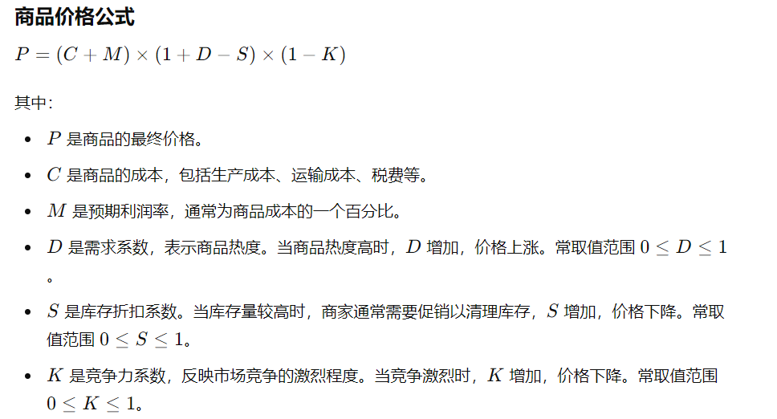
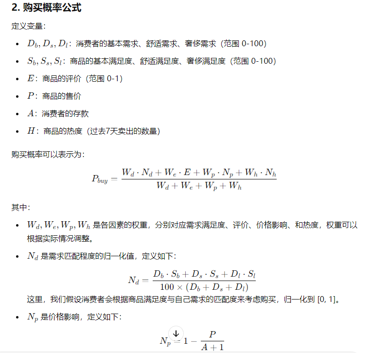
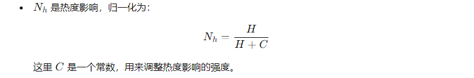
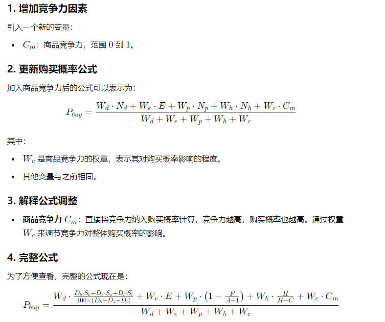
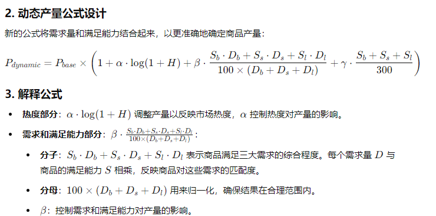
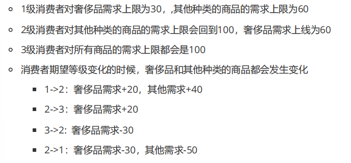

# 模型程序设计-改版

初始化

- n个消费者，n个供应商
- 供应商初始化：
  - 随机分配商品
  - 商品随机分配初始库存
  - 商品随机分配初始产量
- 消费者初始化：
  - 根据消费等级，随机初始需求
  - 固定初始需求
  - 根据消费等级，随机初始化收入
  - 存款初始化为初始收入的乘积

$$ D = \frac{1}{1 + e^{\log H +1}}$$

模拟过程

消费者买商品：

- 根据公式决定是否要买某个商品
  - 每决定买一个，便减少对应的存款
- 重算商品在每个供应商手中购买的概率，决定在谁那里买
- 对于Basic:
  - 价格影响使用消费者收入
- 除Basic外：
  - 价格影响使用消费者存款
- 消费者需求量更新
  - 1：Basic - 20;  Convenient - 10; Luxury - 1;
  - 2: Basic - 20; Convenient - 15; Luxury - 5;
  - 3: Basic - 30; Convenient - 20; Luxury - 10;

供货商更新：

- 商品热度，竞争力
- 商品存量，售价，收益
- 更新总收益

7tick:

- 消费者的收入

- 消费者升级，降级
- 商品售价更新
- 供应商更新商品产量

## 监测内容

1. 总收益 vs 时间
2. 所有消费者的需求均值 vs 时间