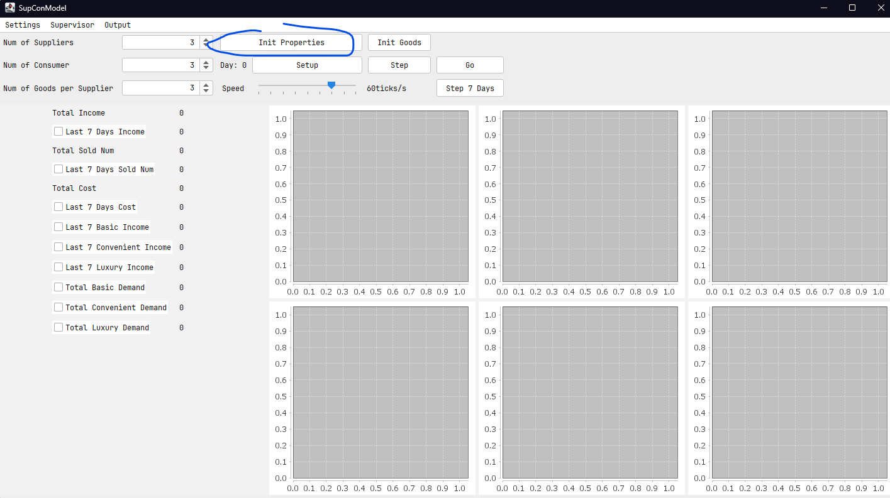
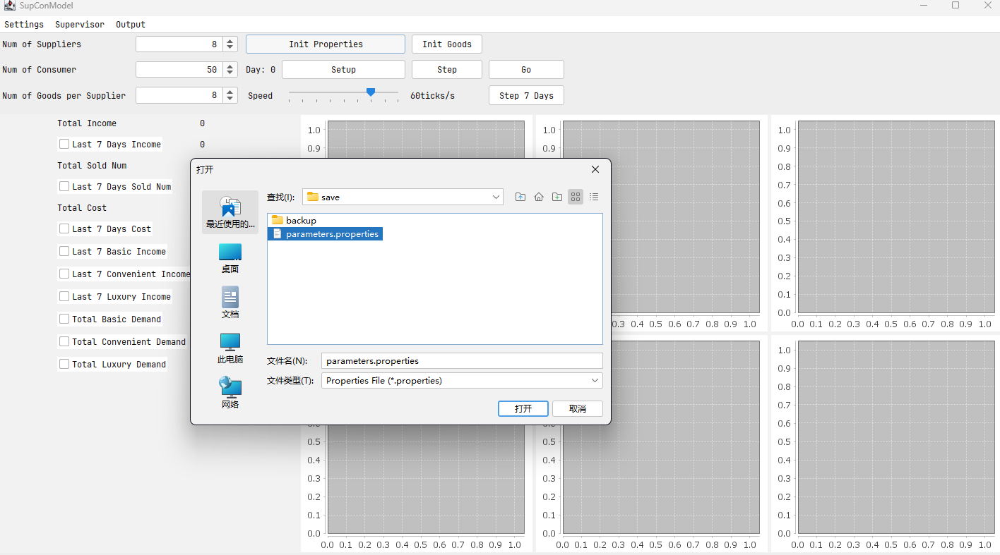
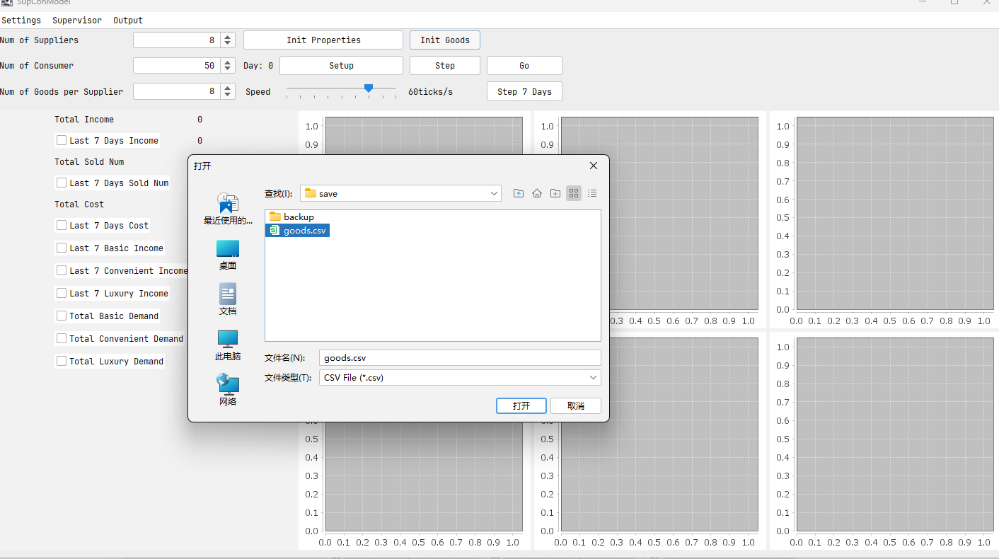

# COMP90083_Project2

Open this model

```cmd
>>> java -jar SupConModel.jar
```

**Before run the model, you need to initialize the properties and goods first!**







There are pre-defined default settings in the project, path:

`````
COMP90083_Project2\SupConModel\save
`````

**Click Setup, then you can start the simulation!**

## Take in mind

- Don't change any properties during the simulation, you can change the properties when the model is not **going**, but remember to **re-setup** after you change any property
- You'd better open the supervisor after you finish **setup**, this will avoid most of the bug in the system.